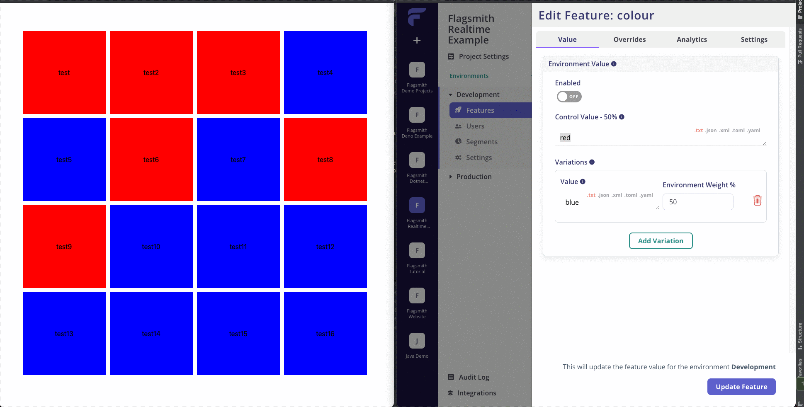
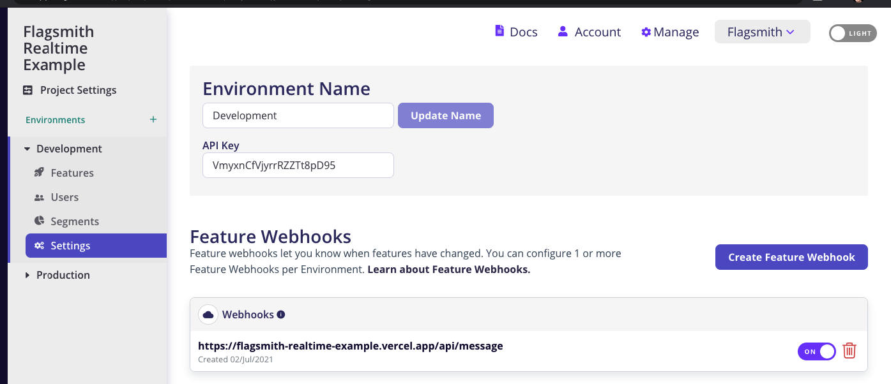

# Realtime Flagsmith using Pusher

This project demonstrates how you can use Flagsmith webhooks alongside Pusher to provide realtime feature flag updates for your application.




## Install
```
npm i
```

## Deployment

**Frontend**

- Create a Flagsmith project and set your environment id in **env.js**
- Create a Pusher project and set your clientside key in **env.js**

**Backend**

Set the following env variables, these are used in /api/message.js:

- pusherappid,
- pusherkey,
- pushersecret,
- pushercluster,
- process.env.pushertls (optional) 


**Flagsmith setup**

In order to get realtime to work you need to setup webhooks, set this to where this is hosted e.g.:




## How it works

**/components/FlagsmithBlock.js**
- Initialises its own instance of flagsmith and identifies as a unique user.
- Subscribes to a pusher channel which is broadcasted via **/api/message.js**
- When it gets a websocket message it retrieves a new set of flags

**/pages/api/message**
- triggers a websocket broadcast
- Should be called with a flagsmith feature webhook, this webhook gets called whenever feature states within the environment change.
